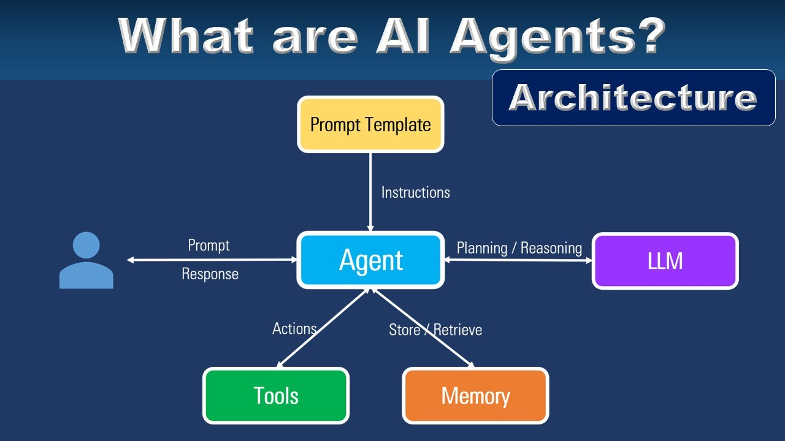
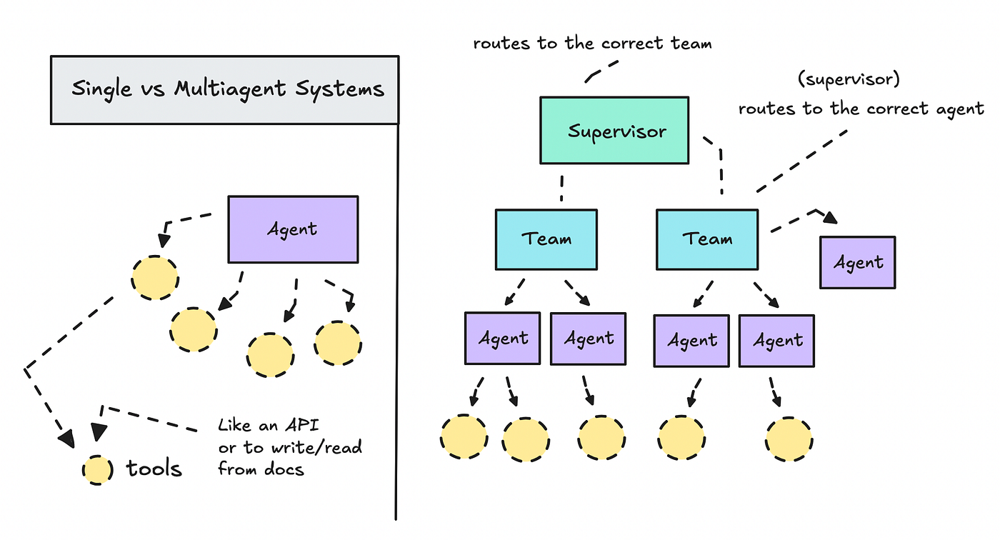

# AI Agent 的设计哲学：为什么"分工协作"比"全能选手"更可靠?

在软件开发领域,有一条被反复验证的真理:**单体应用无法扩展**。无论是构建大型电商平台还是复杂的企业系统,将所有功能塞进一个庞大的程序中,最终都会造成性能瓶颈、调试困难和维护噩梦。这个教训催生了微服务架构的兴起,通过将系统拆解为多个专注于特定职责的小型服务,实现了更高的可靠性和可维护性。

有趣的是,**这一设计哲学正在被应用到 AI 系统的构建中**。当我们试图让一个 AI Agent 承担越来越多的任务时,会发现它逐渐变成了"样样都会、样样不精"的万金油。随着指令复杂度的增加,Agent 对特定规则的遵循能力会下降,错误率会累积,最终导致越来越多的"幻觉"问题。更糟糕的是,当系统出现故障时,你不得不拆解整个庞大的提示词来定位问题所在。

那么,AI 研究者们是如何解决这个问题的呢?答案是:**多智能体系统(Multi-Agent Systems, MAS)**。

## 从单体到微服务:AI Agent 的架构演进

多智能体系统的核心思想与软件工程中的微服务架构如出一辙。与其让一个 Agent 处理所有事情,不如将任务分解,让多个专门化的 Agent 各司其职。一个负责解析文档,一个负责数据提取,一个负责生成摘要,一个负责质量审核。**通过去中心化和专业化,系统的可靠性得到了根本性的提升**。

这种设计带来了几个显著的优势。首先是**模块化**,每个 Agent 都有明确的职责边界,就像乐高积木一样可以灵活组合和替换。其次是**可测试性**,你可以单独测试每个 Agent 的表现,而不需要运行整个系统。最重要的是**可靠性**,当某个环节出现问题时,你能够快速定位到具体的 Agent,而不是在一个庞大的黑盒中盲目搜索。

Google 在其最新发布的 Agent Development Kit (ADK) 中,系统地总结了构建多智能体系统的八种基本设计模式。这些模式不是凭空想象出来的理论,而是从实际生产环境中提炼出的经验。让我们逐一理解这些模式背后的设计思想。

## 八种设计模式:从流水线到人机协作

### 1. 流水线模式:像工厂装配线一样工作

想象一个汽车装配线,每个工位负责一个特定的步骤,零件从一端进入,成品从另一端输出。**流水线模式(Sequential Pipeline Pattern)**正是这样工作的。Agent A 完成任务后,将结果直接传递给 Agent B,B 处理完再传给 C,形成一条线性的处理链。

这种模式的优势在于**确定性和可追溯性**。你总是清楚地知道数据从哪里来、经过了哪些处理、现在在哪个环节。这使得它成为数据处理管道的首选架构。例如,处理一份 PDF 文档时,可以设计这样的流水线:解析 Agent 将 PDF 转换为文本,提取 Agent 从文本中抽取结构化数据,摘要 Agent 生成最终的概要。每个 Agent 只需要专注于自己的任务,通过共享的状态管理机制传递数据。

### 2. 协调者模式:智能的任务调度员

并非所有任务都适合流水线。有时候,你需要的不是一条链,而是一个**决策者**。**协调者模式(Coordinator/Dispatcher Pattern)**引入了一个中央智能 Agent,它像酒店礼宾员一样,分析用户的意图,然后将请求路由到最适合处理该任务的专家 Agent。

这种模式在复杂的客户服务场景中特别有用。当用户提出问题时,协调者 Agent 会判断这是账单问题、技术故障还是产品咨询,然后将请求转发给相应的专家 Agent。每个专家 Agent 都配备了专门的工具和知识库,能够提供高质量的专业服务。关键在于,**协调者的路由决策是由大语言模型驱动的**,它能够理解自然语言中的细微差别,做出智能的分派决策。

### 3. 并行扇出模式:同时开工提升效率

当多个任务彼此独立时,为什么要让它们排队等待呢?**并行扇出/聚合模式(Parallel Fan-Out/Gather Pattern)**允许多个 Agent 同时执行任务,然后由一个综合 Agent 汇总结果。

以自动化代码审查为例。传统方式是依次运行安全检查、代码风格检查和性能分析,整个过程可能需要数分钟。采用并行模式后,可以同时启动安全审计 Agent、风格检查 Agent 和性能分析 Agent,它们各自独立工作,将结果写入不同的键值以避免冲突。最后,一个综合 Agent 将三份报告整合为一条完整的代码审查意见。**这不仅大幅缩短了处理时间,还能从多个视角获得更全面的分析**。

### 4. 层次分解模式:大任务的递归拆解

有些任务过于复杂,单个 Agent 的上下文窗口无法容纳所有信息。**层次分解模式(Hierarchical Decomposition)**通过引入层级结构来解决这个问题。高层 Agent 负责总体规划和任务分解,将子任务委派给下级 Agent,而下级 Agent 可能进一步委派给更底层的工具 Agent。

这就像俄罗斯套娃一样,每一层都有自己的职责范围。例如,一个报告撰写 Agent 不需要亲自去搜索资料,它只需要调用研究助手 Agent。研究助手 Agent 又会协调网络搜索 Agent 和摘要 Agent 来完成工作。**通过将子 Agent 包装为工具,父 Agent 可以像调用函数一样使用整个子系统的能力**,实现了真正的模块化和可复用性。

### 5. 生成器与评论家模式:内置的质量把关

生成高质量、可靠的输出往往需要反复打磨。**生成器与评论家模式(Generator and Critic Pattern)**将内容创建和内容验证分离开来。生成器 Agent 负责产出初稿,评论家 Agent 则根据特定的标准或逻辑检查进行审核。

这种模式的独特之处在于**条件循环机制**。如果审核通过,循环结束,内容被确认;如果审核失败,具体的反馈会被返回给生成器,要求其修正问题后重新生成。这在代码生成场景中尤其有价值——生成器产出代码,评论家检查语法和逻辑错误,直到代码符合规范为止。这种机制确保了输出的正确性,而不仅仅是流畅性。

### 6. 迭代优化模式:追求卓越的打磨过程

与生成器-评论家模式关注"正确性"不同,**迭代优化模式(Iterative Refinement)**关注的是"质量提升"。伟大的作品很少一蹴而就,通常需要经过多轮修改和打磨。这个模式模拟了人类作家的创作过程:生成初稿,批评性地审视,然后基于反馈进行改进,如此循环往复。

在实现上,这个模式使用循环 Agent 来管理迭代过程。可以设置最大迭代次数作为安全阈值,但更智能的做法是让 Agent 自己判断何时达到了质量标准。当评审 Agent 认为输出已经足够好时,可以发出提前退出的信号,避免不必要的计算浪费。**这种自适应的迭代机制,让 AI 系统能够像人类专家一样追求卓越**。

### 7. 状态机模式:处理复杂的业务流程

真实世界的业务流程往往不是简单的线性或树状结构,而是包含多个状态和复杂的转换条件。**状态机模式(State Machine Pattern)**为这类场景提供了解决方案。系统在不同状态之间转换,每个状态对应一个专门的 Agent,转换条件由当前状态的输出决定。

这种模式特别适合处理具有明确阶段的工作流,比如订单处理系统。订单可能处于"待支付"、"待发货"、"运输中"、"已完成"等不同状态,每个状态需要不同的处理逻辑。通过状态机模式,可以清晰地定义每个状态的行为和转换规则,使得复杂的业务逻辑变得可管理和可维护。

### 8. 人在回路模式:关键时刻的人类判断

尽管 AI 系统越来越强大,但在某些关键决策点,**人类的判断仍然不可或缺**。**人在回路模式(Human-in-the-Loop Pattern)**在自动化流程中嵌入人类决策点,让人类专家在关键时刻介入,审核 AI 的输出或提供额外的指导。

这种模式在高风险场景中尤为重要。例如,在医疗诊断辅助系统中,AI 可以分析影像并提出初步诊断建议,但最终的诊断决策必须由医生做出。在内容审核系统中,AI 可以标记可疑内容,但对于边界案例,需要人类审核员进行最终判断。**通过在自动化流程中保留人类的控制权,既享受了 AI 的效率,又保持了人类的责任和伦理把关**。

## 设计模式背后的核心技术

理解这些设计模式的表面逻辑并不困难,但要真正实现它们,需要掌握几个核心的技术概念。

首先是**状态管理**。多个 Agent 需要共享信息,但又不能相互干扰。解决方案是使用共享的会话状态(session.state),每个 Agent 通过指定的键(output_key)写入自己的输出,其他 Agent 可以读取这些数据。这类似于软件开发中的共享内存机制,但需要仔细设计以避免竞态条件。

其次是**Agent 组合**。如何让 Agent 之间建立协作关系?ADK 提供了几种原语:SequentialAgent 用于串行编排,ParallelAgent 用于并行执行,LoopAgent 用于循环逻辑。更高级的技巧是使用 AgentTool,将整个子 Agent 系统包装为一个工具,供父 Agent 调用。**这种递归的组合能力,让你可以构建任意复杂的 Agent 层次结构**。

最后是**控制流机制**。如何决定何时退出循环、如何选择下一个执行的 Agent?这依赖于条件判断和信号机制。Agent 可以通过输出特定的值(如"PASS"或"FAIL")来触发状态转换,也可以通过 escalate 信号来提前终止循环。这些机制赋予了多智能体系统灵活的决策能力。

## 从理论到实践:多智能体系统的现实意义

这些设计模式不仅仅是学术研究的产物,它们正在被应用到真实的生产环境中。Google 的 ADK 工具包提供了这些模式的具体实现,让开发者可以快速构建可靠的多智能体系统。

对于研究者和开发者而言,理解这些模式的价值在于:**它们提供了一套经过验证的思维框架**。当你面对一个复杂的 AI 应用需求时,不再需要从零开始摸索,而是可以问自己:这个任务适合用流水线模式还是协调者模式?是否需要并行处理来提升效率?是否需要迭代优化来保证质量?是否需要人类在关键环节介入?

更深层次地看,多智能体系统的兴起反映了 AI 研究的一个重要趋势:**从追求单一模型的全能,转向构建专业化、模块化的系统**。这与人类社会的组织方式不谋而合——没有人能够精通所有领域,但通过分工协作,人类社会创造了远超个体能力的成就。AI 系统也在遵循同样的规律。

当我们谈论 AI 的未来时,或许不应该只关注模型参数的规模和训练数据的数量,而应该更多地思考:**如何设计更好的协作机制,让多个专业化的 AI 组件能够像交响乐团一样和谐工作**。这才是构建真正可靠、可扩展的 AI 系统的关键所在。

---

**参考资料:**
- [Developer's guide to multi-agent patterns in ADK](https://developers.googleblog.com/developers-guide-to-multi-agent-patterns-in-adk/) - Google Developers Blog, 2025年12月16日
