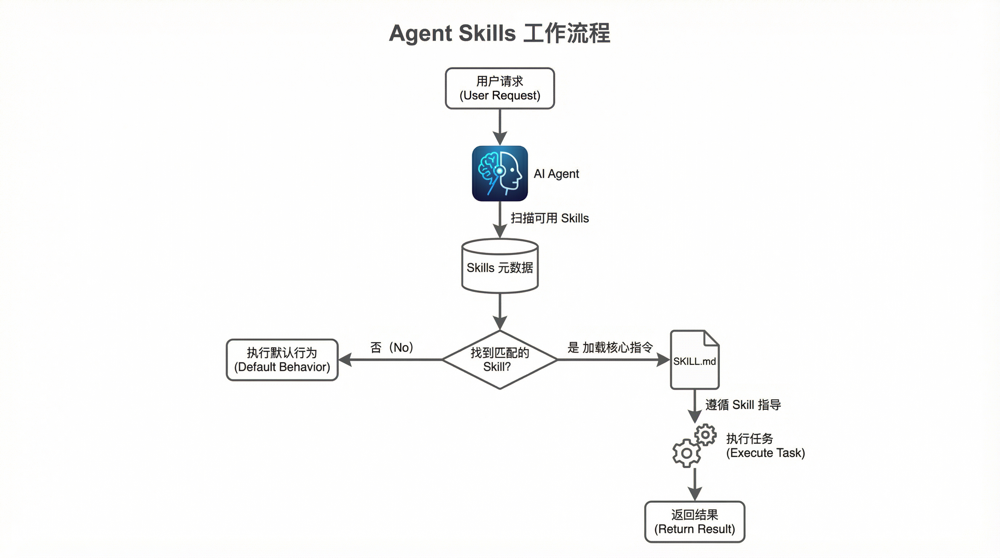

# Agent Skills 入门：为你的 AI 科研助手装备“超级技能”

> 如果说 AI Agent 是你的“科研实习生”，那么 Agent Skills 就是你为它准备的“岗前培训手册”和“专业工具箱”。

作为一名科研人员，你是否曾梦想拥有一个能真正理解你工作流程、无缝对接专业数据库、并能自主完成复杂分析的 AI 助手？**Agent Skills** 的出现，正在让这个梦想变为现实。

不同于以往需要反复调试的冗长提示词，Agent Skills 允许我们将专业知识、工作流程和最佳实践打包成一个个可复用、可共享的“技能包”。AI Agent 在需要时可以自动发现并加载这些“技能”，从而像一个训练有素的专家一样，高效、准确地完成任务。

今天，我们就为各位奋斗在科研一线的博士生、研究员和工程师们，带来一份 Agent Skills 的实战指南。我们将首先推荐几个“开箱即用”的重量级科研 Skills 包，然后简要介绍其背后的工作原理和编写要点。

## 一、重量级科研 Skills 推荐：武装你的 AI 助手

在 Agent Skills 的生态中，已经涌现出不少优秀的开源项目。其中，**K-Dense-AI/claude-scientific-skills** [1] 无疑是目前最全面、最强大的科研 Skills 集合，强烈推荐所有科研人员关注。

### 👑 王者之选：claude-scientific-skills

- **GitHub Stars**: 5.8k+
- **Skills 数量**: 140+
- **覆盖领域**: 生物信息学、化学、医学、机器学习、材料学、物理学等
- **许可证**: MIT

这个项目由 K-Dense 团队创建和维护，旨在将 Claude 改造为一个全能的“AI 科研助理”。它几乎涵盖了科研工作的所有环节，从文献综述到数据分析，再到论文写作和基金申请。

我们从中精选了 **6 个对所有学科都极具价值的核心 Skills**，帮助你快速提升科研效率：

| 推荐 Skill | 核心功能 | 适用场景 |
|:---|:---|:---|
| **scientific-critical-thinking** | 评估研究的严谨性，分析方法论、实验设计、统计有效性、偏倚和证据质量。 | 读文献、审稿、评估自己的研究设计 |
| **literature-review** | 自动化执行系统性文献检索、筛选、质量评估和证据合成。 | 写综述、开题报告、快速了解新领域 |
| **peer-review** | 按照 Nature、Cell、JAMA 等顶级期刊的标准，对论文进行结构化评审。 | 审稿、投稿前自我审查 |
| **hypothesis-generation** | 基于现有文献和数据，系统性地生成可检验的科学假设。 | 课题设计、头脑风暴、寻找创新点 |
| **grant-writing** | 辅助撰写符合 NSF、NIH、国自然等主流基金要求的项目申请书。 | 申请基金、撰写研究计划 |
| **data-analysis-visualization** | 执行统计分析，并使用 matplotlib、seaborn 等工具生成出版级图表。 | 处理实验数据、制作论文和报告配图 |

> **一句话总结**：安装了这个 Skills 包，你的 AI 助手就相当于掌握了 140 多项专业的科研技能，从“通才”一跃成为“专才”。

## 二、Agent Skills 是什么？为什么它很重要？

简单来说，**Agent Skill 就是一个“AI 的软件包”**。它将完成特定任务所需的**指令 (Instructions)**、**资源 (Resources)** 和**工具 (Tools)** 打包在一个文件夹里。

这个类比可以帮助我们更好地理解：

| 传统软件开发 | Agent Skills |
|:---|:---|
| **npm 包** / **Python 库** | **Skill 文件夹** |
| 函数、类、API | 自然语言指令 + 脚本 |
| `import pandas` | AI 激活 `data-analyzer` Skill |
| 调用 `df.groupby()` | AI 遵循 Skill 中的数据分析步骤 |

与传统提示词相比，Skills 具有三大优势：

1.  **模块化与可复用**：将知识和流程固化，一次编写，多次使用。
2.  **按需加载，节省上下文**：只有在需要时才加载，避免了超长提示词对上下文窗口的占用。
3.  **可共享与协作**：团队可以共享一套标准化的 Skills，确保工作流程的一致性。

### 工作原理：渐进式披露 (Progressive Disclosure)

Agent Skills 的高效得益于其独特的“渐进式披露”三层架构 [2]。AI 不会一次性读取所有信息，而是像剥洋葱一样，逐层深入。


-   **第一层：元数据 (Metadata)**：AI 启动时只加载所有 Skills 的名称和描述，快速建立一个“能力索引”。
-   **第二层：SKILL.md 主体**：当用户请求与某个 Skill 的描述匹配时，AI 才会加载该 Skill 的核心指令文件 `SKILL.md`。
-   **第三层：引用文件 (Reference Files)**：如果 `SKILL.md` 中包含了对外部脚本、代码示例或详细文档的引用，AI 会在执行过程中按需读取这些文件。

这种机制确保了 AI 总是在最相关的上下文中工作，既能拥有广博的“知识面”，又能进行专注的“深度思考”。



## 三、如何编写自己的第一个 Skill？

虽然直接使用现成的 Skills 包已经非常强大，但掌握编写自己的 Skill 能让你将 AI 助手的定制化能力发挥到极致。根据 Anthropic 的官方文档 [3] 和社区的最佳实践 [4]，我们总结了几个核心要点：

### 1. 核心文件：SKILL.md

每个 Skill 的核心都是一个名为 `SKILL.md` 的 Markdown 文件。它由两部分组成：

-   **YAML Frontmatter (元数据)**：位于文件顶部的配置区，用于定义 Skill 的名称、描述、版本等。
-   **Markdown Content (指令内容)**：位于元数据下方的正文区，用自然语言告诉 AI 该做什么以及如何做。

### 2. 编写有效的“描述 (description)”

`description` 是 Skill 能否被 AI 发现和激活的关键。它应该：

-   **使用第三人称**：例如，“处理 Excel 文件并生成报告”。
-   **具体且包含关键词**：包含“做什么”和“何时使用”，并覆盖用户可能提到的同义词。

**好的示例**：
```yaml
description: 从 PDF 文件中提取文本和表格，填写表单，合并文档。当处理 PDF 文件或用户提到 PDF、表单、文档提取时使用。
```

### 3. 结构化指令

在指令内容部分，多使用 Markdown 的标题、列表和代码块来组织内容。结构越清晰，AI 执行越可靠。

**一个最小化的 Skill 示例**：

```markdown
---
name: code-review-guideline
description: 根据团队的 Python 编码规范审查代码。当用户请求代码审查或 review 时使用。
version: 1.0.0
---

# Python 代码审查指南

## 核心审查点

1.  **代码风格 (PEP8)**：检查命名、缩进、行长是否符合 PEP8 规范。
2.  **文档字符串 (Docstrings)**：确保所有公共模块、函数、类和方法都有清晰的文档字符串。
3.  **错误处理**：检查是否妥善处理了潜在的异常。
4.  **可读性**：建议更清晰的变量名或重构复杂的逻辑。

## 工作流程

1.  首先，通读代码，理解其整体功能。
2.  然后，按照上述“核心审查点”逐项检查。
3.  最后，以列表形式总结所有建议。
```

将以上内容保存为 `SKILL.md` 文件，放入指定的 Skills 文件夹，你的 AI 助手就学会了这项新技能。

## 结语

Agent Skills 为我们提供了一种前所未有的方式来封装和扩展 AI 的能力。对于科研工作者而言，这意味着我们可以将领域知识、实验流程、数据分析方法沉淀为一个个标准化的“技能包”，构建出真正懂我们专业的强大 AI 科研助手。

从今天起，尝试为你和你的团队装备这些“超级技能”吧！

---

## 参考资料

[1] K-Dense-AI. (2026). *claude-scientific-skills*. GitHub. https://github.com/K-Dense-AI/claude-scientific-skills

[2] Lee, H. (2025, October 26). *Claude Agent Skills: A First Principles Deep Dive*. https://leehanchung.github.io/blogs/2025/10/26/claude-skills-deep-dive/

[3] Anthropic. (2025). *Skill authoring best practices*. Claude Docs. https://platform.claude.com/docs/en/agents-and-tools/agent-skills/best-practices

[4] Hightower, R. (2026, January 5). *Mastering Agentic Skills: The Complete Guide to Building Effective Agent Skills*. Spillwave Solutions. https://medium.com/spillwave-solutions/mastering-agentic-skills-the-complete-guide-to-building-effective-agent-skills-d3fe57a058f1
