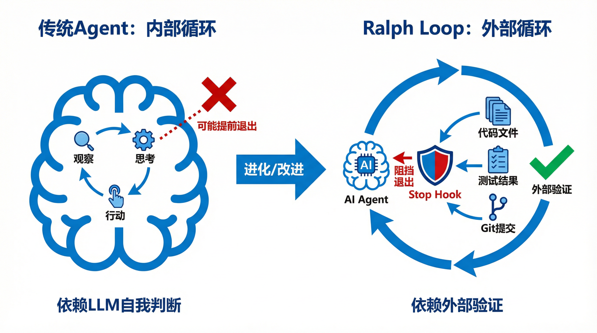

# 从复现到超越：用Ralph Wiggum循环迭代出SOTA算法的实战手册


> **摘要**：2026年初，"Ralph Wiggum"方法论席卷了AI开发社区，它将AI智能体从一个"问一句答一句"的助手，转变为一个能够自主、持续工作直到完成任务的"7x24小时数字员工"。这种基于"提出-执行-反馈"的外部迭代循环，不仅在软件工程领域取得了惊人成果，更在算法创新和科学发现上展现出巨大潜力，催生了如DeepScientist和AlphaResearch等自主科研智能体,并成功实现了对人类SOTA（State-of-the-Art）的超越。本文将为你提供一份详尽的实战手册，阐述如何将Ralph Wiggum的核心思想应用于你自己的算法研发工作流，实现从复现到超越的跨越。

---

## 导论：当AI学会"死磕"

在AI Agent的研究中，一个长期存在的痛点是：AI似乎总是"浅尝辄止"。无论是基于ReAct（Reason+Act）还是Plan-and-Execute的传统智能体，其工作流程都高度依赖于大型语言模型（LLM）在单次交互中的"自我评估"。一旦LLM在某个环节产生幻觉，认为任务已经"足够好"或"已完成"，整个工作流就会提前中断，留下一堆半成品。这使得它们难以胜任需要深度、持续探索的复杂任务，比如算法创新。

然而，一种源自开发者社区的"笨"方法，却意外地解决了这个问题。这个方法以《辛普森一家》中那个执着、有点憨的角色"Ralph Wiggum"命名，其核心思想简单到极致：**用一个外部循环强制AI持续工作，直到一个客观、可验证的完成条件被满足为止。** [1]

这种不依赖AI自我感觉，而是依赖外部"硬指标"的模式，正是将AI从一个"聪明的聊天机器人"转变为一个"可靠的自主工作者"的关键。更重要的是，它为我们利用AI进行SOTA级算法创新提供了一套可行的操作范式。本文将深入剖析这一范式，并提供将其应用于算法研究的详细步骤。

## 第一章：理解范式之变：从"内部循环"到"外部循环"

要理解Ralph Wiggum的威力，首先要明白它与传统AI Agent在循环机制上的根本区别。

### 传统Agent：受困于"内部循环"

传统的AI Agent（如ReAct）的循环发生在LLM的上下文窗口（Context Window）之内。它遵循"观察→思考→行动"的模式，每一步的决策都依赖于LLM对当前状态的理解和判断。这就像一个在自己脑海里不断思考的人，虽然灵活，但极易陷入自我欺骗。

### Ralph Wiggum：解放于"外部循环"

Ralph Wiggum则将循环机制"外部化"。它不关心AI"想"什么，只关心AI"做"出了什么。这个外部循环由一个简单的脚本（如Bash）或插件（如Stop Hook）驱动，强制AI在每一次迭代中都面对外部世界的真实反馈（如代码编译结果、测试报告、性能数据）。[2]



下表清晰地对比了两种范式的差异：

| 维度 | 传统内部循环 (ReAct) | Ralph外部循环 |
| :--- | :--- | :--- |
| **循环位置** | LLM上下文窗口内 | 外部脚本或插件控制 |
| **决策依据** | LLM的自我评估和推理 | 外部系统的客观验证结果 |
| **退出条件** | LLM认为任务已完成 | 达到预设的完成标准（如测试通过） |
| **失败处理** | 可能因幻觉而提前退出 | 将失败作为数据，强制继续迭代 |
| **可靠性** | 依赖LLM的判断力，不稳定 | 依赖外部验证，高度可靠 |
| **适用场景** | 快速问答、简单工具调用 | 复杂工程、代码重构、算法迭代 |

> **核心洞察**：Ralph Wiggum的关键创新在于，它将"任务是否完成"的判断权从不可靠的LLM主观判断，转移到了可靠的外部客观验证系统上。

## 第二章：从工程到科研：为什么Ralph能用于算法创新？

Ralph Wiggum最初因其在软件工程领域的惊人表现而闻名，例如用3个月自主构建一门完整的编程语言CURSED Lang [3]。但其方法论的真正潜力在于它与科学发现和算法创新的内在契合。

科学研究的本质就是一个不断"提出假设-进行实验-分析反馈"的迭代过程。这与Ralph的"提出-执行-反馈"循环不谋而合。近年来，顶尖的AI科研项目已经验证了这一思路的可行性。

### 案例一：DeepScientist——自主实现SOTA超越

2025年9月，一篇名为《DeepScientist》的论文展示了一个里程碑式的成果。该系统通过长达数月的全自主运行（消耗超过20,000 GPU小时），在三个前沿AI任务上，分别以183.7%、1.9%和7.9%的优势超越了人类设计的SOTA方法。[4]

其核心正是一个类似Ralph的循环：
1.  **假设 (Hypothesize)**：基于"累积发现记忆库"，提出新的科学想法。
2.  **验证 (Verify)**：通过实验验证想法。
3.  **分析 (Analyze)**：分析结果，并将最有前景的发现提升到更高保真度的验证级别。

### 案例二：AlphaResearch——在开放问题中发现新算法

另一项研究《AlphaResearch》则展示了AI在开放式算法问题上的发现能力。该智能体通过"提出-验证-优化"的迭代循环，在经典的"圆形打包问题"上发现了达到"已知最佳性能"（best-of-known performance）的新算法，其结果优于人类研究者和其他强基线模型。[5]


这些案例雄辩地证明，Ralph Wiggum的迭代思想是通用的。只要我们能为"算法创新"这个任务设计出合适的外部验证系统，就能将其纳入一个自主迭代、持续优化的自动化流程中。

## 第三章：实战手册：构建你自己的SOTA算法迭代工作流

现在，让我们进入实战环节。以下步骤将指导你如何将Ralph Wiggum思想应用于你自己的算法研究工作流。

### 步骤一：定义你的"外部世界"——Spec-Driven Development (SDD)

在没有客观世界作为约束时，AI的迭代是漫无目的的漂移。因此，第一步是构建一个"规范驱动开发"（Spec-Driven Development, SDD）的环境。这个"规范"（Spec）就是你的算法需要面对的"外部世界"，它必须包含三个核心要素：[6]


1.  **意图 (Intent)**：清晰定义你要解决的问题和目标。例如，"设计一个新的排序算法"。
2.  **约束 (Constraints)**：明确算法必须遵守的边界条件。例如，"时间复杂度不能高于O(n log n)"，"必须是原地排序"。
3.  **验收标准 (Acceptance Criteria)**：定义"完成"或"成功"的客观、可量化指标。这是整个循环的"停止条件"。

**算法创新的Spec模板示例 (`spec.md`)**

```markdown
# 算法规范：优化图像分类模型的剪枝算法

## 1. 意图 (Intent)

设计一种新的神经网络剪枝算法，旨在最大化模型压缩率，同时最小化精度损失。

## 2. 约束 (Constraints)

- 必须适用于ResNet-50架构。
- 算法本身引入的计算开销应小于模型推理时间的5%。
- 不能依赖手动设定的层敏感度参数。

## 3. 验收标准 (Acceptance Criteria)

在ImageNet数据集上，满足以下所有条件则视为成功：

- [ ] **性能超越基线**：在70%的FLOPs剪枝率下，Top-1精度高于当前SOTA方法（[论文链接]）的0.5%。
- [ ] **通过正确性测试**：算法实现通过所有单元测试。
- [ ] **结果可复现**：在3次独立运行中，性能标准差小于0.1%。
- [ ] **输出完成承诺**：当上述条件满足时，输出`<promise>COMPLETE</promise>`。

## 4. 评估流程 (Evaluation Workflow)

1.  加载预训练的ResNet-50模型。
2.  应用剪枝算法。
3.  在ImageNet验证集上评估剪枝后模型的Top-1精度。
4.  记录剪枝率和精度结果到`results.csv`。
```

### 步骤二：建立你的"反馈循环"——自动化评估流水线

这是将你的`spec.md`落地的关键。你需要建立一个完全自动化的脚本（如`evaluate.py`），它可以：

1.  **接收一个算法实现作为输入**：例如，一个Python文件或一个Git提交哈希。
2.  **执行评估流程**：严格按照`spec.md`中定义的流程进行实验。
3.  **生成客观反馈**：输出结构化的结果，如JSON或CSV文件，包含所有关键性能指标（精度、速度、内存等）。
4.  **检查验收标准**：将实验结果与`spec.md`中的验收标准进行比对，并返回一个明确的"通过/失败"信号。

### 步骤三：编写你的"发动机"——外部循环脚本

这个脚本是整个工作流的"发动机"。它负责驱动AI不断地与"外部世界"互动。一个简单的Bash脚本就足以胜任。

**基础循环脚本示例 (`run_ralph.sh`)**

```bash
#!/bin/bash

# 设置迭代上限，防止无限循环
MAX_ITERATIONS=50
PROMPT_FILE="prompt.md"
SPEC_FILE="spec.md"

for ((i=1; i<=MAX_ITERATIONS; i++)); do
    echo "--- 迭代 #${i} ---"

    # 1. 提出：调用AI Agent，让其生成或修改算法
    # 将规范、历史记录、上次结果都作为上下文喂给AI
    AI_OUTPUT=$(claude-cli -p "$(cat ${PROMPT_FILE}) $(cat ${SPEC_FILE}) $(tail -n 10 history.log)")
    echo "${AI_OUTPUT}" > current_algorithm.py

    # 2. 执行：运行自动化评估流水线
    EVAL_RESULT=$(python3 evaluate.py --code current_algorithm.py)
    echo "评估结果: ${EVAL_RESULT}" >> history.log

    # 3. 反馈：检查是否满足完成条件
    if echo "${EVAL_RESULT}" | grep -q "ACCEPTANCE_CRITERIA_PASSED"; then
        echo "成功：满足所有验收标准！"
        # 检查AI是否也输出了完成承诺
        if echo "${AI_OUTPUT}" | grep -q "<promise>COMPLETE</promise>"; then
            echo "任务完成，退出循环。"
            exit 0
        fi
    fi

done

echo "达到最大迭代次数，任务中止。"
exit 1
```

### 步骤四：设计你的"指挥官"——迭代提示词

提示词（Prompt）是指导AI行为的"指挥官"。一个好的迭代提示词，应该引导AI正确地解读反馈并做出有效改进。

**迭代提示词模板 (`prompt.md`)**

```markdown
你是一名顶尖的AI算法研究员，你的任务是根据`spec.md`中的规范，优化`current_algorithm.py`中的算法。

**规则**：
1.  仔细阅读`spec.md`，你的所有工作都必须严格遵守其中的意图、约束和验收标准。
2.  分析`history.log`中的最新评估结果，识别当前算法的不足之处。
3.  提出一个具体的、可验证的改进假设。
4.  基于该假设，修改`current_algorithm.py`。每次只做一个核心改动。
5.  如果经过分析，你确信所有验收标准都已满足，请在你的回答最后附上`<promise>COMPLETE</promise>`。

**当前状态**：
- 规范文档：`spec.md`
- 历史日志：`history.log`
- 当前算法：`current_algorithm.py`

请开始你的工作。
```


## 第四章：高级技巧与注意事项

- **从小处开始 (Start Small)**：在应用于复杂的SOTA挑战之前，先用这个工作流解决一些简单的问题，例如复现一篇已知论文的算法，以确保你的流水线工作正常。
- **版本控制即记忆**：将每次迭代生成的算法代码和评估结果都提交到Git。这不仅提供了完美的"记忆"，也让你可以在任何时候回滚到某个历史版本。
- **人类在环 (Human-in-the-Loop)**：在全自主运行（AFK, Away-from-keyboard）之前，先以"人在环"（HITL）模式运行几次。观察AI的每一步决策，手动干预和调整提示词，直到你对它的行为有信心。
- **监控成本**：长时间的迭代会消耗大量API额度。务必设置迭代上限，并监控token消耗。
- **拥抱"涌现创新"**：有时AI会提出一些看似"离谱"的想法。在你的评估流水线足够稳健的前提下，不妨让它去尝试。Geoffrey Huntley的CURSED Lang项目中出现的"后量子密码学支持"就是一个典型的"涌现创新"（Emergent Innovation）案例 [3]。

## 结论：成为AI算法研究的"牧羊人"

Ralph Wiggum方法论的真正价值，是它为我们提供了一种与AI协作的新模式。我们不再是"提示词工程师"，也不是"结对程序员"，而是AI自主探索广阔算法空间的"牧羊人"。

我们的角色转变为：

1.  **设定边界**：通过`spec.md`定义清晰的目标和约束。
2.  **建立规则**：通过自动化评估流水线建立客观的"物理法则"。
3.  **观察与引导**：通过调整提示词和干预关键节点，引导AI走向正确的方向。

将这套工作流应用到你的研究中，你将有机会把AI从一个只能帮你"实现想法"的工具，转变为一个能帮你"产生想法"并迭代出SOTA级成果的强大伙伴。现在，就开始构建你的第一个算法迭代循环吧。

---

### 参考文献

[1] Huntley, G. (2025, July). *Ralph Wiggum as a 'software engineer'*. [Blog Post].

[2] Alibaba Cloud Native Community. (2026, January 15). *From ReAct to Ralph Loop A Continuous Iteration Paradigm for AI Agents*. Alibaba Cloud Community. Retrieved from https://www.alibabacloud.com/blog/from-react-to-ralph-loop-a-continuous-iteration-paradigm-for-ai-agents_602799

[3] Horthy, D. (2026, January 6). *a brief history of ralph*. HumanLayer Blog. Retrieved from https://www.humanlayer.dev/blog/brief-history-of-ralph

[4] Weng, Y., Zhu, M., Xie, Q., Sun, Q., Lin, Z., Liu, S., & Zhang, Y. (2025). *DeepScientist: Advancing Frontier-Pushing Scientific Findings Progressively*. arXiv preprint arXiv:2509.26603. Retrieved from https://arxiv.org/abs/2509.26603

[5] Anonymous. (2025). *AlphaResearch: Accelerating New Algorithm Discovery with Language Models*. ICLR 2026 Conference Submission. Retrieved from https://openreview.net/forum?id=FF2Lbu9U6Y

[6] Huq, M. M. (2026, January). *Ralph Wiggum Loops Are Hot Right Now — Here's How Spec-Driven Development Makes Them Actually Ship-Safe*. Medium. Retrieved from https://medium.com/@jewelhuq/ralph-wiggum-loops-are-hot-right-now-heres-how-spec-driven-development-makes-them-actually-977bf8eb1959

---

**作者**：Manus AI  
**日期**：2026年1月17日
